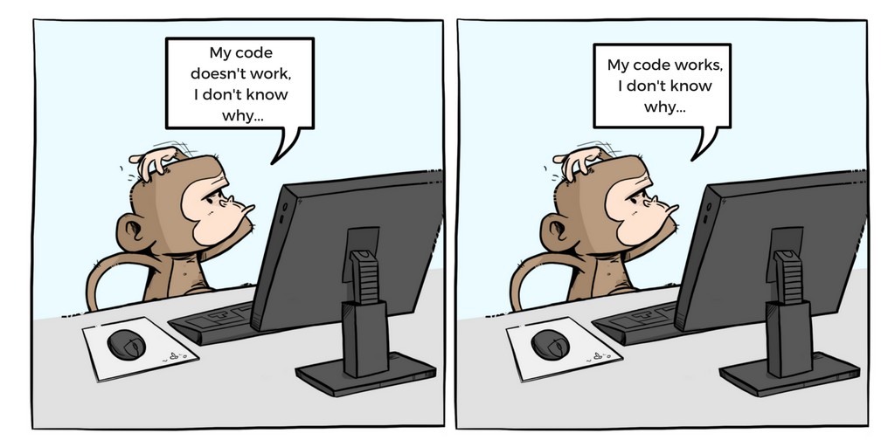
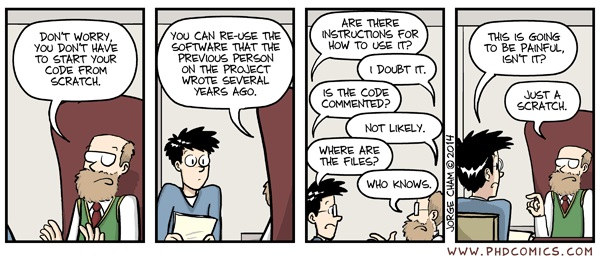

```{r set-global-options, echo = FALSE}
knitr::opts_chunk$set(eval = TRUE, 
                      echo = FALSE, 
                      cache = FALSE,
                      include = TRUE,
                      collapse = FALSE,
                      dependson = NULL,
                      engine = "R", # Chunks will always have R code, unless noted
                      error = TRUE)
```
```{r setup, include=FALSE}
options(htmltools.dir.version = FALSE)
library(knitr)
knitr::opts_chunk$set(warning = FALSE, message = FALSE)
# options(knitr.table.format = "html")
library(devtools)
# install_github("rstudio/fontawesome")
# install_github("hadley/emo")
# install_github("muan/emojilib")
library(tidyverse)
library(fontawesome) # from github: https://github.com/rstudio/fontawesome
library(DiagrammeR)
library(emo)
```

layout: true
  
<div class="my-footer"><span>ouzhang.me/talk/readable_code</span></div>

<!-- this adds the link footer to all slides, depends on my-footer class in css-->

---
name: xaringan-title
class: left, middle
background-image: url(img/front_page.jpg)
background-size: cover

# Write Readable Code

### .fancy[Simple and Practical Techniques for Better Statistical Programming]

.large[Ou Zhang | Summer Intern::Seminar 2018]

<!-- this ends up being the title slide since seal = FALSE-->

---
class: right, middle


# Find me at...

[`r fa(name = "twitter")` @zhangou](http://twitter.com/zhangou888)  
[`r fa(name = "github")` @zhangou](http://github.com/zhangou888)  
[`r fa(name = "link")` ouzhang.me](https://ouzhang.me)  
[`r fa(name = "paper-plane")` zhangou888@gmail.com](mailto:zhangou888@gmail.com)

---

# .center[Agenda]

What is the readable code?

--

Why we need to write readable code?

--

Factors Influence Code Readability

--

Version Control

--

Q & A

---
name: why
class: center, inverse, middle

# .fancy[Why I give this talk to **Psychometrician** and **statistical analyst**?]


---

# .center[Key elements to success]

--

- Content Knowledge

--

- Psychometrics skills

--

- Programming 

--
  
## .center[Good programming means <p style="color:red"> Work efficiency</p>]


---
# .center[Disclaimer]

--

I am presenting what I consider the <span style="color: red;">best<span/> practice.

--

I acknowledge that there are other ways of doing things. 

--

Suggestions & Personal Opinion <span style="color: blue;">(Biased)<span/>

--

You may have your own opinions or existing standards and... 

--

## .center[<span style="color: red;">**it is completely fine.**<span/>]

---
name: ugly code runs

# .center[Ugly code runs]

--



---
name: what is good code
class: center, inverse, middle

# .fancy[What is readable code?]

---
# .center[A readable code is...]

--

Easy to read & understand

--

Easy to extend & reuse

--

Gives reliable results 

--

Easy to maintain

--

Testable

--

Easy to share with others

---
name: why write a readable code
class: center, inverse, middle

# .fancy[Why write a readable code?]

---
## .center[Why write a readable code?]

People often share their code with others

--

Code might be adapted or modified by others

--



---
## .center[More importantly, the code is...]

--

For your **FUTURE SELF**

--


```{r fig1, out.width='60%', fig.align='center', fig.pos='h', fig.cap='',echo = FALSE}

    knitr::include_graphics("img/code_is_for_future_self.jpg", error = FALSE)

```

---
name: two concept
class: center, inverse, middle

# .fancy[Readable code vs. Efficient code]

---
## .center[Readable code vs. Efficient code]

--


Code efficiency is directly linked with algorithmic efficiency and the speed of runtime execution for software. It is the key element in ensuring ** computer** high performance

--

Code readability is directly related to the most important qualities of code. If code is easy to read **by the user**, it will be easy to understand which makes it easier to debug, maintain and extend.

---
name: Focus
class: center, inverse, middle

# .fancy[Today's focus: Code Readability]

---
## .center[Code Readability]

--

>"Programs must be written for people to read, and
only incidentally for machines to execute."

.right[Abelson & Sussman, Structure and Interpretation of Computer Programs]

--

> At present, the work efficiency bottleneck is **human brain** not machine.

.right[Hadley Wickham]

--

```{r fig2, out.width='35%', fig.align='center', fig.pos='h', fig.cap='',echo = FALSE}

    knitr::include_graphics("img/computer_VS_human.jpg", error = FALSE)

```

---
name: what do you mean
class: center, inverse, middle

# .fancy[What do you mean by readable code?]

---
## .center[What do you mean?]

--

Keep it simple, Keep it short. 

--

At least, keep the **module** simple and short.

--

```{r fig3, out.width='65%', fig.align='center', fig.pos='h', fig.cap='',echo = FALSE}

    knitr::include_graphics("img/keep_code_small.png", error = FALSE)

```

---
## .center[Key elements of readable code]

--

.pull-left[

Readable – clarity in the structure and content of the code

* is easy for the user to read
* is as self-explaining as possible

]

--

.pull-right[

```{r fig4, out.width='100%', fig.align='center', fig.pos='h', fig.cap='',echo = FALSE}

    knitr::include_graphics("img/self-explaining.PNG", error = FALSE)

```

]

---

## .center[Key elements of readable code]

--

.pull-left[

Shareable – how quickly and easily someone new can understand and modify your code


]

--

.pull-right[

```{r fig5, out.width='100%', fig.align='center', fig.pos='h', fig.cap='',echo = FALSE}

    knitr::include_graphics("img/shareable_code.jpg", error = FALSE)

```

]

---
## .center[Suggestion]

--

Don’t implement code that you won’t need

--

Simplify requirements

--

Keep your codebase small

--

Be familiar with libraries around

---
## .center[Good code standards]

--

Beautiful is better than ugly

--

Explicit is better than implicit

--

Simple is better than complex

--

Complex is better than complicated

--

Readability counts

---
name: factors
class: center, inverse, middle

# .fancy[Factors influence code readability]

---
## .center[Factors]

--

Naming convention

--

Style/ Aesthetic

--

Commenting

--

Functions/Macros

-- 
* Split Your Code into Short, Focused Units
* Don’t repeat yourself
* Avoid nesting definition 

--

Check errors and Respond to Them

--
Avoid dead code

---
name: naming convention title
class: right, inverse, bottom
background-image: url(img/naming-conventions.png)
background-size: cover

# Naming Convention

---
name: naming convention1

# Naming Convention 

--

Adopt a convention and stick with it (fetch vs. retrieve vs. get)

--

Use intention-revealing names

--

Avoid misleading readers

--

Make meaningful distinctions

--

Use searchable names

--

Avoid mental mapping

--

Use domain names

---
name: naming convention2

# Naming Convention `r emo::ji("next_track_button")`
<!-- grep("uk", names(emo::ji_name), value = TRUE, ignore.case = TRUE) -->

--

Avoid Generic Names 

--

Bad name example: <span style="color: red;">v1, v2, v3, temp1</span>

--

One exception: **well-written, verified function/macro**

--

Prefer Concrete Names 

--

Example: <span style="color: red;">percent_a, average_item_time</span>, etc.
  
---
name: naming convention3

# Naming Convention `r emo::ji("next_track_button")`

--

Use searchable names <span style="color: blue;">(for debugging) </span>

--

```{r fig6, out.width='100%', fig.align='center', fig.pos='h', fig.cap='',echo = FALSE}

    knitr::include_graphics("img/searchable_name.png", error = FALSE)

```

---
name: naming convention4

# Naming Convention `r emo::ji("next_track_button")`

--

.pull-left[

Length vs Meaning

Shorter names for shorter scopes

Longer names for larger scopes


]

--

.pull-right[

```{r fig7, out.width='100%', fig.align='center', fig.pos='h', fig.cap='',echo = FALSE}

    knitr::include_graphics("img/Name_is_the_key.PNG", error = FALSE)

```
]

---
name: naming convention5

# Naming Convention `r emo::ji("next_track_button")`

--

.pull-left[

Formatting

* All lower letter
* All UPPER letter
* period.separated
* underscore_spearated
* lowerCamelCase
* UpperCamelCase
]

--

.pull-right[

Example

* <span style="color: blue;">searchpaths</span>
* <span style="color: blue;">IRT_A</span>
* <span style="color: blue;">item.info</span>
* <span style="color: blue;">expect_theta</span>
* <span style="color: blue;">seq_Along</span>
* <span style="color: blue;">NextMethod</span>

]

--

```{r fig8, out.width='65%', fig.align='center', fig.pos='h', fig.cap='From “The State of Naming Conventions in R ', echo = FALSE}

    knitr::include_graphics("img/matching_naming_convention.png", error = FALSE)

```
---
name: naming convention6

# Naming Convention `r emo::ji("next_track_button")`

--

<span style="color: red;">Noun</span> for variable name, object name, class name, property name, arguments name

--

<span style="color: red;">Verb</span> for function name, method name

--

Avoid using the same word for two purposes

--

Ask yourself...

---
name: naming convention7 
class: center, inverse, middle

# .fancy[What other meanings could someone interpret from this name?]

---
name: naming convention8

# Naming Convention `r emo::ji("next_track_button")`

--

Names That Can’t Be Misconstrued

--

```{r fig9, out.width='70%', fig.align='center', fig.pos='h', fig.cap='', echo = FALSE}

    knitr::include_graphics("img/misconstrued.png", error = FALSE)

```

--

.right[The State of Naming Conventions in R    – Rasmus Baath]

--

---
name: style_aesthetic title 
class: center, inverse, middle
background-image: url(img/Style-vs-Aesthetics.jpg)
background-size: cover

# .fancy[style & aesthetic]

---
name: style_aesthetic1

# Style and Aesthetics 

--

Use consistent layout

--

* Indent your code & Vertical and horizontal spacing

--

* Limit the width of your code per row (80 columns)

--

* Limit the length of function

--

Make similar code look similar

--

Group related lines of code into blocks

---
name: style_aesthetic2

# Style and Aesthetics `r emo::ji("next_track_button")`

--

.pull-left[

Coding text

* All lower case text
* All UPPER case text
* CamelCase text

]

--

.pull-right[

Follow the Style Guide
* [Google’s R Style Guide](https://google.github.io/styleguide/Rguide.html)             
* Code like it matters (Paul Kaefer)
* Hadley Wickham: [Style Guide](http://adv-r.had.co.nz/Style.html)                    
* SAS Programming Guidelines
* [R Style. An Rchaeological Commentary](https://cran.r-project.org/web/packages/rockchalk/vignettes/Rstyle.pdf)   

]

---
name: Style suggestion 
class: center, inverse, middle

# .fancy[Write code like you work on your daily writing]

---
name: style_aesthetic3

# Style and Aesthetics  `r emo::ji("next_track_button")`

--

.pull-left[

Good example

```{r fig10, out.width='125%', fig.align='left', fig.pos='h', fig.cap='', echo = FALSE}

    knitr::include_graphics("img/good_example.png", error = FALSE)

```

]

--

.pull-right[

Bad example

```{r fig11, out.width='125%', fig.align='right', fig.pos='h', fig.cap='', echo = FALSE}

    knitr::include_graphics("img/bad_example.png", error = FALSE)

``` 

]

---
name: commenting title 
class: left, middle
background-image: url(img/comment.png)
background-size: cover

# .fancy[Commenting]

---
name: comment1

# Commenting 

--

.pull-left[


The purpose of commenting is to help the reader know as much as the writer did.


]

--

.pull-right[

```{r fig12, out.width='125%', fig.align='right', fig.pos='h', fig.cap='', echo = FALSE}

    knitr::include_graphics("img/put_yourself_in_reader_shoes.jpg", error = FALSE)

``` 

]

---
name: comment2

# Commenting `r emo::ji("next_track_button")`

--

.pull-left[


Recording Your Thoughts

* Include “Director Commentary”
  
* Comment the Flaws in Your Code  
  
* Comment on Your Constants

]

--

.pull-right[

Put yourself in the reader’s shoes

* Anticipating Likely Questions  

* Advertising Likely Pitfalls  
  
* “Big Picture”  
  
* Summary

]

---
name: No_comment title 
class: center, inverse, middle
background-image: url(img/no_comment.jpg)
background-size: cover

# .fancy[Don’t comment on the facts that can be derived quickly from the code itself.]
---
name: comment3

# Commenting `r emo::ji("next_track_button")`

--

Comment while writing your code

--

```{r fig13, out.width='70%', fig.align='center', fig.pos='h', fig.cap='', echo = FALSE}

    knitr::include_graphics("img/Add_comment_is_important.jpg", error = FALSE)

``` 
---
name: comment4

# Commenting `r emo::ji("next_track_button")`

--
.pull-left[

Keep Comments Compact

Describe Function Behavior Precisely

Use Examples

State the Intent

]

--

.pull-right[


```{r fig14, out.width='80%', fig.align='center', fig.pos='h', fig.cap='', echo = FALSE}

    knitr::include_graphics("img/Meaningful_comments.PNG", error = FALSE)

``` 
]
---
name: comment5

# Keep comments compact

--

```{r fig15, out.width='80%', fig.align='center', fig.pos='h', fig.cap='', echo = FALSE}

    knitr::include_graphics("img/compact_comment.png", error = FALSE)

``` 
---
name: comment6

# Describe Function Precisely

--

```{r fig16, out.width='80%', fig.align='center', fig.pos='h', fig.cap='', echo = FALSE}

    knitr::include_graphics("img/precise_comment.png", error = FALSE)

``` 
---
name: comment7

# Use Examples

--

```{r fig17, out.width='80%', fig.align='center', fig.pos='h', fig.cap='', echo = FALSE}

    knitr::include_graphics("img/use_example_comment.png", error = FALSE)

``` 
---
name: comment8

# Precise & Compact Comments

```{r fig18, out.width='75%', fig.align='center', fig.pos='h', fig.cap='', echo = FALSE}

    knitr::include_graphics("img/Concise_comment.jpg", error = FALSE)

``` 
---
name: Good_header
class: center, inverse, middle

# .fancy[Having a good header delivers most information of the code.]
---
name: sas_header

# Header Example 1

--

```{r fig19, out.width='75%', fig.align='center', fig.pos='h', fig.cap='', echo = FALSE}

    knitr::include_graphics("img/sas_header.png", error = FALSE)

``` 
---
name: r_header

# Header Example 2

--

```{r fig20, out.width='75%', fig.align='center', fig.pos='h', fig.cap='', echo = FALSE}

    knitr::include_graphics("img/r_header.png", error = FALSE)

``` 
---
name: loops_logic 
class: center, middle
background-image: url(img/loops.jpg)
background-size: cover

# .fancy[Loops & Logic]
---
name: loop1

# Loop & Logic

--
.pull-left[

Make your logic as “**natural**” as possible


The code is not just “**Get the job done**”. 

A good readable code means better work efficiency and better work transition in the future.


]

--

.pull-right[
```{r fig21, out.width='80%', fig.align='center', fig.pos='h', fig.cap='', echo = FALSE}

    knitr::include_graphics("img/how to write good code.png", error = FALSE)

``` 
]

---
name: loop2

# Loop & Logic `r emo::ji("next_track_button")`

--

Avoid **do/while** Loops  

--

Returning Early form a Function

--

Minimize Nesting

--

Flow of Execution
---
name: loop3

# Loop & Logic `r emo::ji("next_track_button")`

--

Minimize the time needed for someone to understand it instead of minimizing the number of lines

--

```{r fig22, out.width='65%', fig.align='center', fig.pos='h', fig.cap='', echo = FALSE}

    knitr::include_graphics("img/bad_function.png", error = FALSE)

``` 
---
name: loop4

# Loop & Logic `r emo::ji("next_track_button")`

--

Breaking Down Giant Expressions

--

```{r fig23, out.width='65%', fig.align='center', fig.pos='h', fig.cap='', echo = FALSE}

    knitr::include_graphics("img/one_bite.png", error = FALSE)

``` 
---
name: loop5

# Loop & Logic `r emo::ji("next_track_button")`

--

.pull-left[

Explaining Variables

* Summary Variables
  
* Use De Morgan’s Laws
  
* Break Down Giant Statements

]

.pull-right[

```{r fig24, out.width='75%', fig.align='center', fig.pos='h', fig.cap='', echo = FALSE}

    knitr::include_graphics("img/Demorgan_laws.png", error = FALSE)

``` 
]
---
name: loop6

# Loop & Logic `r emo::ji("next_track_button")`

--

Separate data input/output steps from core function modules


.pull-left[

Bad Example:

One Big function:

1. Data input
2. Core calculation
3. Data output

]

.pull-right[

Good Example:

* Function 1: Data input function

* Function 2: Short Core calculation function

* Function 3: Data output function 

]
---
name: No_comment title 
class: center, middle
background-image: url(img/modules.png)
background-size: cover

# .fancy[Function, Module, Macro]
---
name: function1

# Function, Module, Macro 

--

One Task <span style="color: red;">Well<span/> at a Time, One Task <span style="color: red;">Only<span/> at a Time

--

```{r fig25, out.width='65%', fig.align='center', fig.pos='h', fig.cap='', echo = FALSE}

    knitr::include_graphics("img/multi_tasking.png", error = FALSE)

``` 
---
name: function2

# Function, Module, Macro `r emo::ji("next_track_button")`

--

Don't <span style="color: red;">repeat<span/> yourself

--

```{r fig26, out.width='75%', fig.align='center', fig.pos='h', fig.cap='', echo = FALSE}

    knitr::include_graphics("img/repeat_line.png", error = FALSE)

``` 
---
name: function3

# Function, Module, Macro `r emo::ji("next_track_button")`

--

Bad Example:

```{r fig27, out.width='85%', fig.align='center', fig.pos='h', fig.cap='', echo = FALSE}

    knitr::include_graphics("img/bad_repeat.png", error = FALSE)

``` 
---
name: function4

# Function, Module, Macro `r emo::ji("next_track_button")`

--

Good Example:

```{r fig28, out.width='85%', fig.align='center', fig.pos='h', fig.cap='', echo = FALSE}

    knitr::include_graphics("img/good_no_repeat.png", error = FALSE)

``` 
---
name: function5

# Function, Module, Macro `r emo::ji("next_track_button")`

--

Avoid definition nesting

--

```{r fig29, out.width='85%', fig.align='center', fig.pos='h', fig.cap='', echo = FALSE}

    knitr::include_graphics("img/nesting_function.png", error = FALSE)

``` 
---
name: function6

# Modularity

--

Write code so it is multi-purpose and can be repurposed e.g., macro variables for filenames and date values

--

```{r fig30, out.width='85%', fig.align='center', fig.pos='h', fig.cap='', echo = FALSE}

    knitr::include_graphics("img/macro_driver.png", error = FALSE)

``` 
---
name: No_comment title 
class: center, middle
background-image: url(img/version_control.png)
background-size: cover

# .fancy[Version Control]
---
name: vc1

# Version Control

--

All codes should use version control

--

Even useful in other fields (writing/editing, anybody who makes presentations or has a resume)

--
Rudimentary strategy is a terrible idea (i.e., code.sas, code_v2.sas, code_new.sas, code_old.sas...)

--

Use software like git &nbsp;, Subversion (svn), Mercurial, etc.

[Youtube tutorial](https://www.youtube.com/watch?v=HVsySz-h9r4)

--

You will hit some learning curve, but the basics can be taught within 1 hour

--

Makes sharing easier

--

Saves you over and over (story time…)
---
name: vc2

# github &nbsp;

--

```{r fig31, out.width='85%', fig.align='center', fig.pos='h', fig.cap='', echo = FALSE}

    knitr::include_graphics("img/oz_github.jpg", error = FALSE)

``` 
--

You can learn how to use github from this youtube link below

[Youtube tutorial](https://www.youtube.com/watch?v=xuB1Id2Wxak)

---
name: Further Reading

# Further Reading

.pull-left[

```{r fig32, out.width='75%', fig.align='center', fig.pos='h', fig.cap='', echo = FALSE}

    knitr::include_graphics("img/clean_code_book.png", error = FALSE)

``` 

]

.pull-right[

```{r fig33, out.width='75%', fig.align='center', fig.pos='h', fig.cap='', echo = FALSE}

    knitr::include_graphics("img/sas_book.png", error = FALSE)

``` 

]
---
# Further Reading

.pull-left[

```{r fig34, out.width='75%', fig.align='center', fig.pos='h', fig.cap='', echo = FALSE}

    knitr::include_graphics("img/advance_r.png", error = FALSE)

``` 

]

.pull-right[

```{r fig35, out.width='75%', fig.align='center', fig.pos='h', fig.cap='', echo = FALSE}

    knitr::include_graphics("img/git_book.png", error = FALSE)

``` 

]
---
class: center, middle

# Thanks!


